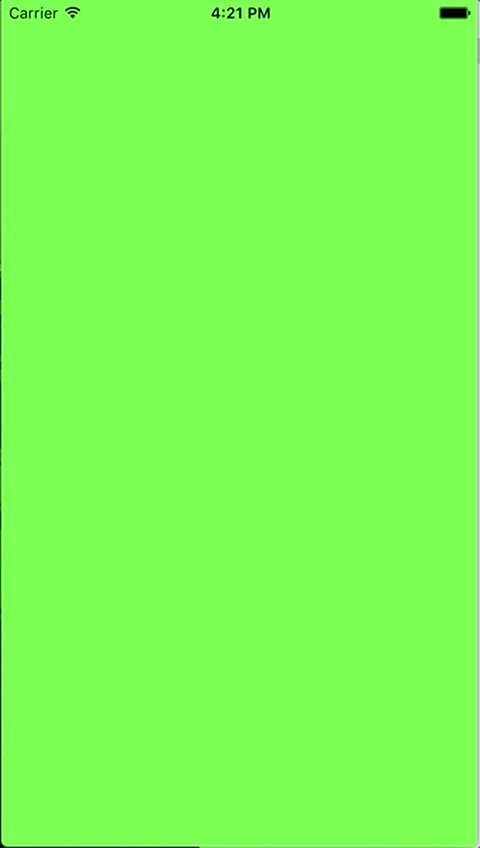

# JKHBezierMenu

JKHBezierMenu is a quick simple proof of concept with bits and pieces of code taken from various sources made to mimic the behavior of this dribbble concept:

[Sidebar animation by: Jakub Antalik](https://dribbble.com/shots/1949368-Sidebar-animation)

This project was written in Swift 3.0 and takes advantage of concepts like:

		- Bezier Curves
		- Container View Controllers
		- CADisplayLink
		- CGTransforms

## Credit and Inspiration

[Jakub Antalik](https://dribbble.com/shots/1949368-Sidebar-animation)

[Danil Gontovnik](https://medium.com/@gontovnik/elastic-view-animation-or-how-i-built-dgelasticpulltorefresh-269a3ba8636e#.6ygtqunjz)

[Filip Radelic](https://github.com/fichek/InteractiveShape)

## Usage
  
In the framework folder contains `JKHBezierMenuContainerViewController`.

This view controller will contain your center view controller and menu view controller.

The `JKHBezierMenuConfiguration` struct you can pass in specifies various properties of the animation, bezier control points, and menu. The config parameter of the JKBezierMenuContainerViewController initializer has a default value so you may omit it if desired.

To use in your AppDelegate:

		let cvc = JKHBezierMenuContainerViewController(withCenterVC: centerVC, menuVC: menuVC, config: config)
		
		window?.rootViewController = cvc
		window?.makeKeyAndVisible()
		
That's it!

## Author

Joon Ki Hong